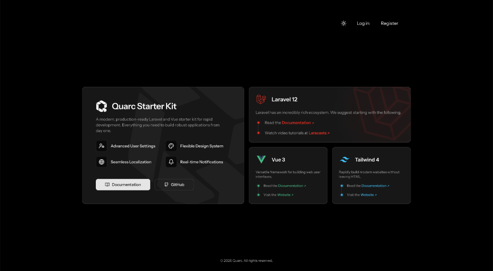

<p align="center">
  
</p>

# Quarc Starter Kit

**Quarc** is a modern **Starter Kit** with a **Vue.js** frontend and **Laravel** backend for developing web applications quickly.



## Core Stack

- **Laravel**: Powerful backend framework.
- **Vue.js**: Modern frontend.
- **Inertia.js**: For seamless integration of Vue and Laravel (monolith).
- **Tailwind CSS**: Utility-first CSS framework.

## Installation

> [!NOTE]  
> Before creating your first Quarc project, ensure that your local machine has [PHP](https://php.net) and [Node.js](https://nodejs.org) installed.

You may install the starter kit via the Laravel installer:

```bash
laravel new my-app --using=quarc/vue-starter-kit
```

Alternatively, you may clone the repository manually:

```bash
git clone https://github.com/quarc/vue-starter-kit.git my-app
cd my-app
```

### Post-Installation

Once the project is installed, install the dependencies and configure the environment:

```bash
composer install
npm install
cp .env.example .env
php artisan key:generate
```

### Database & Migration

Quarc is configured to use SQLite by default. Ensure the database file exists and run migrations:

```bash
touch database/database.sqlite
php artisan migrate --seed
```

### Start Local Server

To start the development server, you may run the following command:

```bash
npm run dev
```

In a separate terminal, start the Laravel server:

```bash
php artisan serve
```

## Key Features

- **Authentication**: Laravel Fortify with custom UI.
- **Internationalization**: Gemini AI powered translation management.
- **Notifications**: Real-time notifications with archive support.
- **Settings**: Comprehensive user settings page.

## Documentation

- [Detailed Feature Overview](docs/quarc-overview.md)

## License

The Quarc Starter Kit is open-sourced software licensed under the [MIT license](LICENSE).

## Status

🚧 **Project under development**

---

*Designed with developers in mind.*
