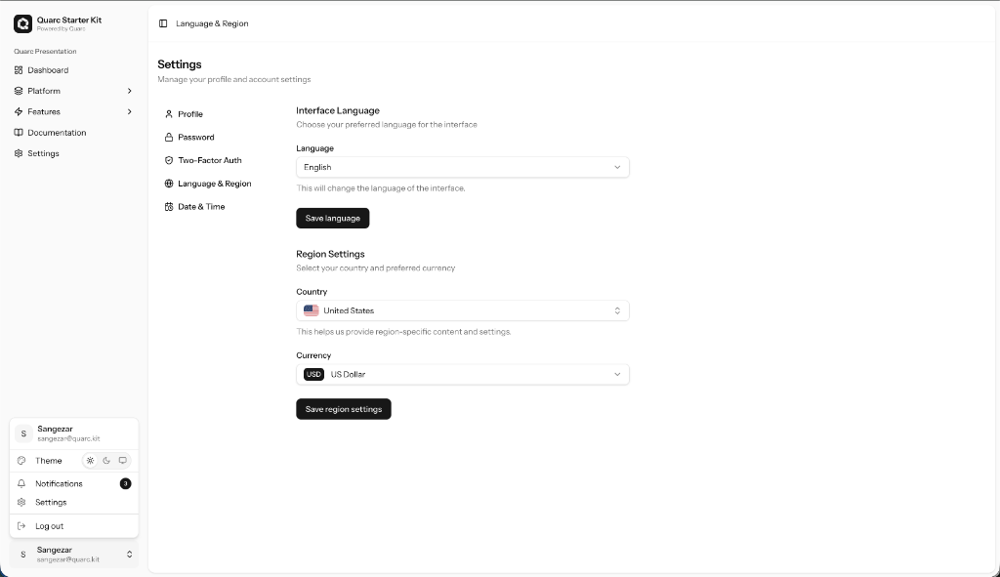
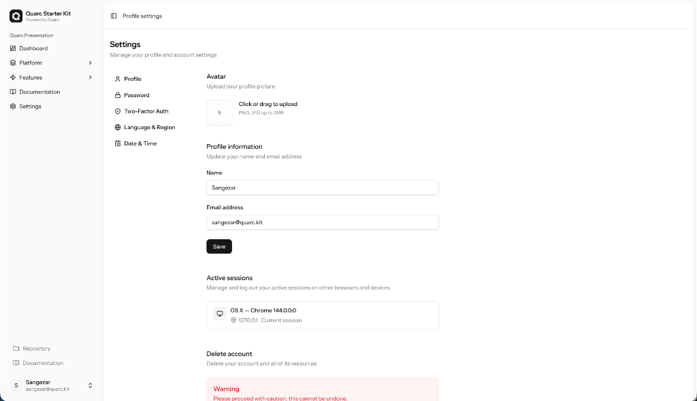
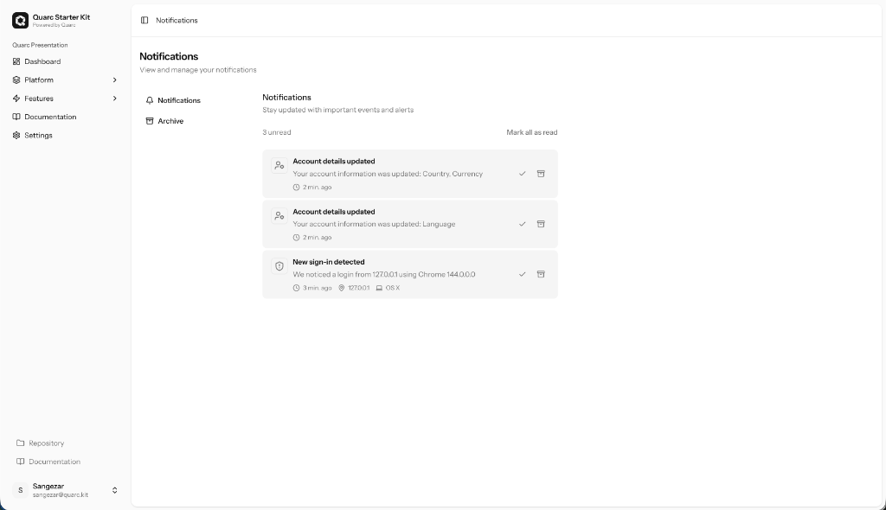
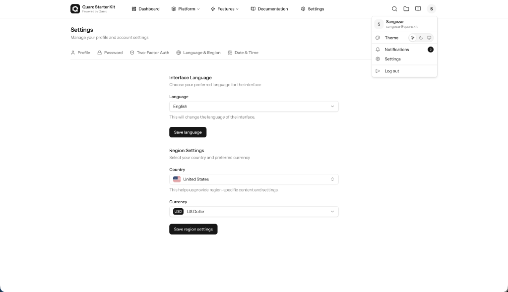

# Quarc Starter Kit Features

Quarc is more than just a template. It is a set of tools and abstractions that significantly accelerate the development of modern Laravel + Vue applications by providing ready-made solutions for common tasks.

## 1. Extended User Model
We don't just use the standard `users` table. Quarc adds the context necessary for global SaaS applications.

- **Localization and Formatting**:
  - `locale`: Preferred interface language.
  - `timezone`: Automatic date conversion to the user's timezone.
  - `date_format` / `time_format`: Flexible time display settings (MDY vs DMY, 12h vs 24h).
  - `currency`: User's primary currency (USD, EUR, UAH, etc.).
  - `country`: Country of residence (2-letter code).
- **Profile**: Built-in support for avatars (URL or file upload).

## 2. Flexible Navigation System (`NavigationManager`)
Forget about hardcoding links in Vue components. All navigation is managed centrally via config or a dynamic manager.

- **Class-Based**: Navigation is defined via PHP classes implementing `NavigationSection`, registered in `NavigationServiceProvider`.
- **Nesting**: Support for multi-level menus and groups.
- **Access Rights**: Integration with Laravel Gates/Policies (`can`) — menu items are hidden automatically if the user lacks permissions.
- **Feature Flags**: Integration with Pennant — hide menu items if a feature is disabled globally.

## 3. Advanced Notification System
A full-fledged notification center, ready to use.

- **Archiving**: Users can archive messages instead of deleting them.
- **Restoration**: Ability to restore messages from the archive.
- **Statuses**: Clear separation into read/unread.
- **UI**: Ready-made interface with list, pagination ("Load More"), and Empty States.

## 4. UI and Customization (`config/ui.php`)
Centralized management of the application's appearance.

- **Themes**: Built-in support for light, dark, and system themes.
- **Layouts**: Ability to toggle navigation (Sidebar / Topbar) and content width (Container / Full Width).
- **Branding**: Configure logo, name, and slogan via config.

---

*This document describes the current functionality and will be expanded as the project evolves.*
